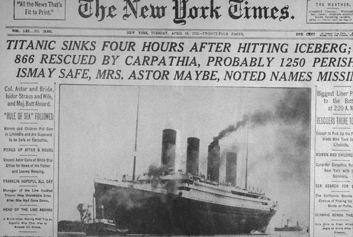

# IMPORTANT

**If you're planning to code along, make sure to clone, download, or re-pull this repository on the morning of Friday 12/01. All edits will be completed by end of day ET Thursday 11/31.**


# How to complete a Kaggle Competition with Machine Learning

with Hugo Bowne-Anderson. Follow him on twitter [@hugobowne](https://twitter.com/hugobowne)

After a successful first Facebook Live Coding session, DataCamp's very own Hugo Bowne-Anderson is back in front of the camera! This time, Hugo will take you from zero to one with machine learning to make several submissions to Kaggle's (in)famous [Titanic machine learning competition](https://www.kaggle.com/c/titanic). The goal will be to build an algorithm that predicts whether any given passenger on the Titanic survived or not, given data on them such as the fare they paid, where they embarked and their age. You'll do so using the Python programming language, Jupyter notebooks and state-of-the-art packages such as `pandas`, `scikit-learn` and `seaborn`. Alongside Hugo, you'll dive into this rich dataset and build your chops in exploratory data analysis, data munging and cleaning, and machine learning. No previous experience with machine learning necessary. Join us for this live, interactive code along.

Join Hugo live on Friday 12/01 at 10:30am ET on Facebook!

<p align="center">

</p>


## Prerequisites

Not a lot. It would help if you knew

* programming fundamentals and the basics of the Python programming language (e.g., variables, for loops);
* a bit about `pandas` and DataFrames;
* a bit about Jupyter Notebooks;
* your way around the terminal/shell.


**However, I have always found that the most important and beneficial prerequisite is a will to learn new things so if you have this quality, you'll definitely get something out of this code-along session.**

Also, if you'd like to watch and **not** code along, you'll also have a great time and these notebooks will be downloadable afterwards also.

If you are going to code along and use the [Anaconda distribution](https://www.anaconda.com/download/) of Python 3 (see below), I ask that you install it before the session.

**Note:** We may be making some live submissions to [Kaggle](https://www.kaggle.com) so, if you want to do that, get yourself an account before the session.


## Getting set up computationally

### 1. Clone the repository

To get set up for this live coding session, clone this repository. You can do so by executing the following in your terminal:

```
git clone https://github.com/datacamp/datacamp_facebook_live_titanic
```

Alternatively, you can download the zip file of the repository at the top of the main page of the repository. If you prefer not to use git or don't have experience with it, this a good option.

### 2. Download Anaconda (if you haven't already)

If you do not already have the [Anaconda distribution](https://www.anaconda.com/download/) of Python 3, go get it (n.b., you can also do this w/out Anaconda using `pip` to install the required packages, however Anaconda is great for Data Science and I encourage you to use it).

### 3. Create your conda environment for this session

Navigate to the relevant directory `datacamp_facebook_live_titanic` and install required packages in a new conda environment:

```
conda env create -f environment.yml
```

This will create a new environment called fb_live_titanic. To activate the environment on OSX/Linux, execute

```
source activate fb_live_titanic
```
On Windows, execute

```
activate fb_live_titanic
```


### 4. Open your Jupyter notebook

In the terminal, execute `jupyter notebook`.

Then open the notebook `1-titanic_EDA_first_models.ipynb` and we're ready to get coding. Enjoy.


### Code
The code in this repository is released under the [MIT license](LICENSE). Read more at the [Open Source Initiative](https://opensource.org/licenses/MIT). All text remains the Intellectual Property of DataCamp. If you wish to reuse, adapt or remix, get in touch with me at hugo at datacamp com to request permission.
